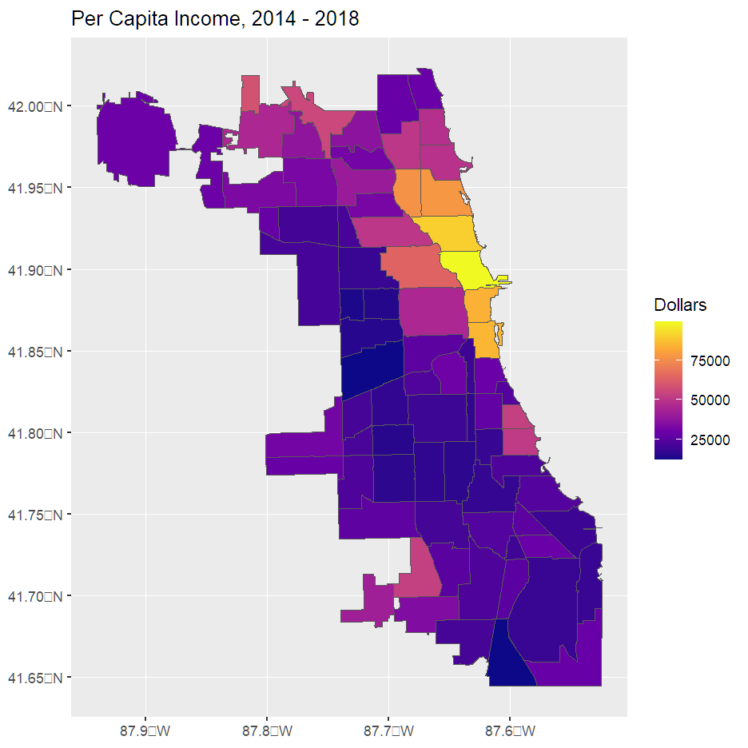
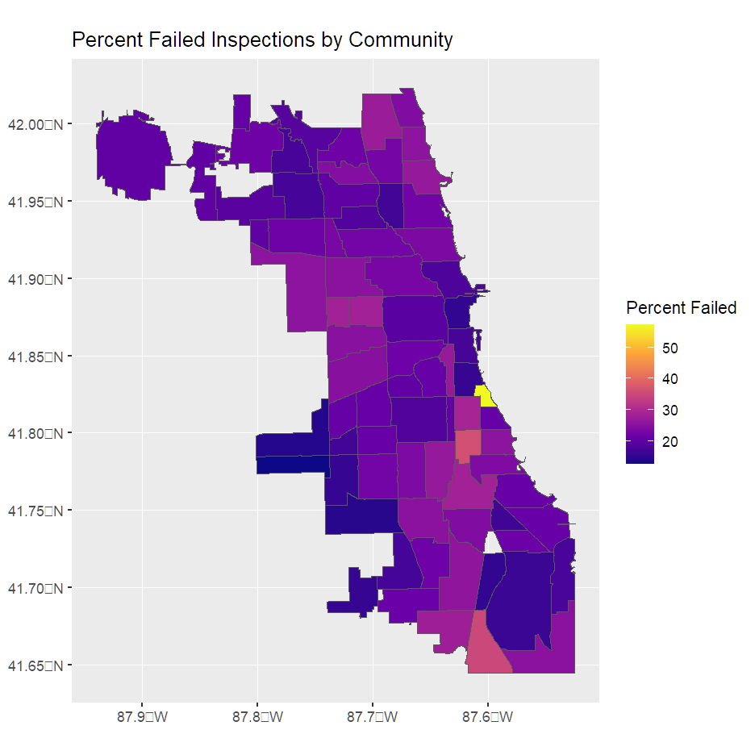
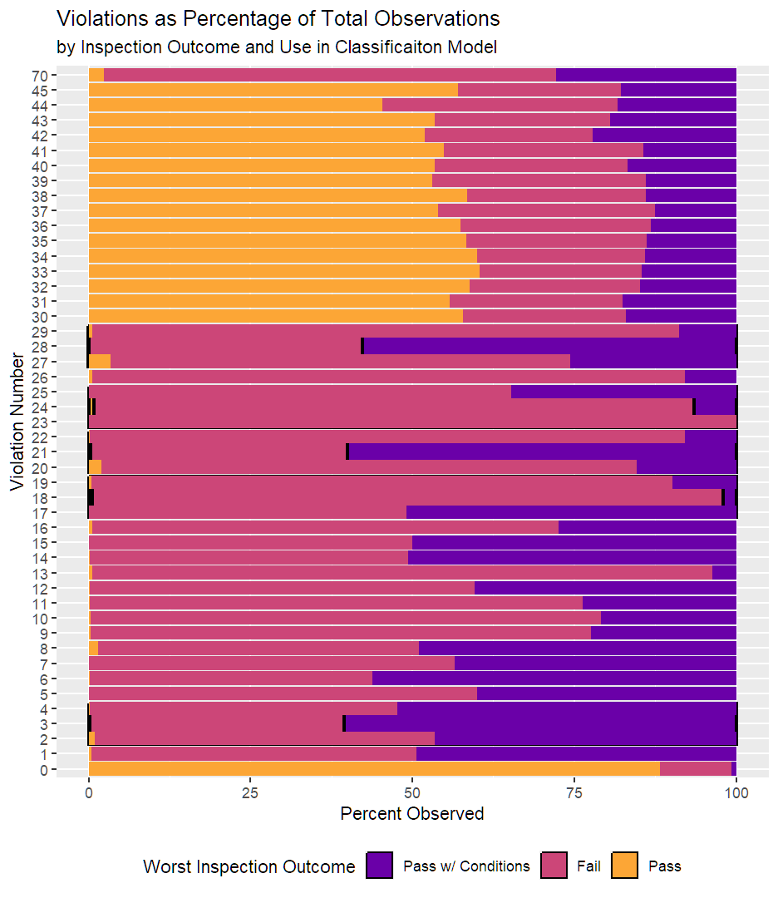

# NoRats: Predicting Chicago restaurant inspection failures from geospatial data and text of past observations  

## A project by Mark Benmuvhar and Dr. Stephen Quinn

## Overview

NoRats combines demographic and restaurant health inspection data with spatial maps of Chicago neighborhoods and restaurant locations. Textural analysis performed on citations categorizes specific concerns. A decision tree classifier is used to predict characteristics of restaurants having subsequent serious violations.

## Introduction

The Chicago Department of Public Health (CDPH) inspects retail food establishments for hygiene and food safety practices. Between 2010 and 2017, the Chicago Department of Public Health performed an average of 13,000 inspections per year, or just under 1 inspection per restaurant. Of these, restaurants received annual notification of 47,000 violations and failing outcomes 18% of the time. Routine canvassing inspections operate to ensure the health of Chicago's 2.8 million residents, while for-cause inspections address complaints and illness outbreaks when concerns arise.  

The outcomes of these inspections are public record and are available for 2010 to 2019. Facility inspection records may contain trends that can indicate patterns of increased risk to attending a restaurant. In this review, we first considered the overlay of inspections and community areas to understand if demographic information (i.e. income, population) were associated with inspection failures. Separate from the demographic information, violation history was assessed to determine if it could classify businesses that had failed inspections.  

The classification model identified several key violations, with the most important violation involving rodent and pest control. Based on these observations, we questioned if pest violations were related to weather or location. We identified subcategories to correlate with regional weather during the inspection period.  

## Methods

Food health inspection records, community boundaries, and community demographics were downloaded from CDPH.
Inspection records were limited to those performed on restaurants prior to July 1, 2018. After that date, Chicago implemented a new inspection rubric that was inconsistent with prior years. Data sets were further cleaned and merged to ensure a consistent relationship among communities, demographics, and inspection data.  

Inspection observations were parsed to obtain a record of violation number, its regulatory definition, and the specific observation.  
Last, weather history for the inspection period was obtained from the National Centers for Environmental Information.  This was joined by date with inspection history.  

Businesses were classified based on the most severe outcome from historical inspections. These classifications ranged from businesses that had either always passed, conditionally passed, or had experienced one or more failures. Recursive partitioning and regression tree analysis was performed to model the relationship between business classification and violation history.  

The partitioning tree analysis identified pest control practices (violation 18) as a key differentiator among inspection outcomes. Topic modeling on specific violations text, identifying common phrases used in the observation for a violation was performed.  The terms appearing between 10% and 95% of observations were grouped into four categories.  Key terms for rodent and insect populations were identified and used to identify inspection subsets for comparison with weather conditions.   

The [codebase](https://github.com/Marmuvar/NoRats/tree/main/src) contains the following files:
| File | Description |
| -- | -- |
| demographicMaps.rmd | Community demogrpahic and business information |
| inspectionStats.rmd | Summary statistics for inspection frequency and outcomes |
| CARTModel.rmd | Analysis of inspection frequency |
| PestStudy.rmd | Textual and weather related analysis of rat and bug violations |

## Packages and Files

## Results

### Demographics and Business Characterization

Chicago's 77 community areas exhibit significant diversity in racial and socioeconomic status (figures 1 and 2).  However, over 30% of businesses were located in just four communities (Near North Side, Loop, Near West Side, and Lake View) (figure 3). Although the frequency of failed inspections appeared to differ on a community basis (figure 4), most failures clustered in the areas with high business populations (figure 5). Considering both the high population and per capita income in these areas, it seemed that there would be insufficient variation in the demographic data among inspections to merit further analysis.  For these reasons, we designed the investigation to focus on the text of the inspections and the observed deficiencies.    

 

 

 

 

 

 

### Predicting Inspection Outcomes

We next used a classification and regression tree (CART) to understand which violations could be strong indicators of the result of an inspection. The model indicated that four violations (18 - Pests, 3 - Food Temperature, 21 - Certified Food Manager, and 29 - Corrected Previous Violation) differentiated the inspection outcomes.   

Using a 80-20 Train/Test split, we find the following predictions on the t  est set:

| Prediction / Actual | Pass | Pass with Conditions | Fail |
| -- | -- | -- | -- |
| Pass | 7456 | 562 | 481 |
|Pass w/ Conditions | 2 | 1239 | 236
| Fail | 1 | 56 | 1751 |

The overall accuracy is 88.65%.  The most important metric to get precise, is correctly accessing a Pass.  While the sensitivity for Pass is high (at 99.96%), the specificity for Pass is low comparatively (at 75.88%).  If the four violations were the only ones a restaurant was assessed on, roughly 1 in 8 of the restaurants are designated by the model as Pass should have been Pass with Conditions and another 1 in 8 should have received a Fail.  This is a serious flaw with the model.

In a second CART model, we looked at how frequency of violations being documented at a restaurant can serve as an indicator for whether a restaurant has ever Failed or Passed Conditionally.  Specifically, looking only at restaurants which have at least three canvass type inspections, and only considering canvasses and for cause inspections, restaurants fall into one of three classes:  

* Fails: Restaurants which have failed at least one inspection.  

* Conditional: Restaurants which have not failed, but have at least one “Pass w/ Conditions” 

* Passes: Restaurants which have always passed.  

The values on the branches correspond with the proportion of inspections where a restaurant has received a specific violation.  We can also see that having a low frequency for Violation 18, Violation 29, Violation 21, and Violation 3 is a strong, but not perfect, indicator that a restaurant will always pass inspections.  In this model, we see that Violation 18 is again the most prominent reason for failing an inspection.  When a restaurant has had more than 0.3% of their inspections having received Violation 18, they can expect to have failed at least one inspection.  We can also see the importance of Violation 29 in studying repeated inspections. Correcting previous violations is important to passing.

Using an 80-20 Train-Test Split, we find this model has a 84.95% accuracy.

| Prediction / Actual | Pass | Conditional | Fail |
| -- | -- | -- | -- |
| Pass | 269 | 62 | 76 |
| Coniditional | 0 | 205 | 105 |
| Fail | 0 | 22 | 1015 |

This model demonstrates a 100% sensitivity and 90% specificity for Passes.  For restaurant inspections, it is more important to have a specificity than it is to have a high sensitivity.  In order to protect public health, inspections should err on the side of allowing restaurants a conditional pass rather than allowing them to operate with unsafe conditions.  

### Model Characteristics

The CART model differentiated businesses using the presence of only 5 violation types, which we refer to as “key violations”.  In the CART model, the key violations provided the strongest indication over the result of a restaurant inspection.   While the key violations comprised less than 10% of the total observed violations (table 3, figure 8), they provided an effective tool for differentiating the inspection patterns of businesses that had always passed their inspections from those that had conditionally passed or failed their inspections. 

To understand the violation selection, the proportion of each inspection outcome for each violation was calculated (figure 9).   Interestingly, violations that appeared more frequently in businesses with passing results (e.g. 30-45)  did not have a classification benefit.  Also, violation 0 (no observations) was unused despite its presence favoring passing inspections.   

| Violation Number | Description |Frequency Observed in Failure |
| -- | -- | -- |
| 3 | Potentially hazardous food meets temperature requirement during storage, preparation, display, and service. | 1.8 |
| 18 | No evidence of rodent or insect. Outer openings protected/rodent proofed. A written log shall be maintained, available to the inspectors. | 2.7 |
| 21 | Certified food manager on site when potentially hazardous foods are prepared and served. | 1.7 |
| 24 | Dish washing facilities properly designed, constructed, maintained, installed, located, and operated. | 0.5 |
| 29 | Previous minor violation(s) corrected. | 1.2 |

As indicated by both CART models, the violation which is most frequently associated with not passing an inspection is Violation 18.  Within this violation, we find there are several main reasons for why a restaurant receives this violation: rodents, insects, logs, and seals.

The locations and kitchen appliances typically refer to locations where evidence of vermin are found. There are also frequent references to logs or logbooks, which are required by restaurants to keep records of visits by pest control companies (which should be done twice a year), descriptions on application of pesticides, and recommended corrective actions by the pest control company. Finally, there sure be sufficient barriers to discourage entrance by pest, such as including screens over windows, self-closing doors, and forms of rat-proofing.

Based on the wordcloud, the observations accompanying the violations were further filtered into two categories.  Inspections observing rodents (words “mice”, “mouse”, “rat” “rodent”) or insects (words “fly”, “flies”, “roach”, “insect”, “bug”, “gnat”) were counted.  The percentage of all inspections observing rodents or insects was charted for each month, irrespective of year.  While rodent observations were constant throughout the year (figure 11), insect observations increased in the summer and the fall (figure 12).  

 

The percent of observations for Violation 18 that mention rodents (rats, mice, mouse) out of all inspections was computed for each month (figure 11).  Here, we see that the observation of rodents is consistent from February to July before showing some increase through September and potential decline through January.  More investigation is needed to determine if this seasonality is significant or reflective of overall variance in the data set.   

In Figure 12, we examine the monthly percent of violations mentioning insects out of all inspections in a given month.  Here, we see that the percentage of Violation 18 observations which mention insects (including roaches, flies, and gnats) increases strongly in the summer and early fall months.

Another reason for receiving Violation 18 is related to improper log books.  The terms “log” and “logbook” were identified in the document cloud as a frequent term in the observations for Violation 18.  A restaurant is required to keep this logbook up to date with records of required biannual pest control visits and records of pest control measures implemented, among other details. Further analysis will be needed to identify the most common flaws with the log books.

Inspection history was joined with daily weather patterns for minimum temperature.  Minimum temperatures were broken into four bands.  The percentage of inspections occurring on each day with insect observations was reported based on the temperature band.  As expected from the monthly data, a lower percentage of inspections observed insects on days in lower minimum temperature bands.  This suggests that the minimum temperature variable could be useful for development of a regression or classification model in future studies.

## Future Investigations  

The current investigation focussed on for-cause and routine canvassing inspections. However, the study did not consider business licensing inspections, facility reinspection, and consultations, which represented around 85,000 additional inspections.  While these categories appear sufficiently different from the studied types, a similar approach may be applicable in understanding a relationship among these groups.  

For future data cleaning, several known deficiencies were identified in the data set.  First, because unique businesses were identified using the establishment’s license number and `AKA Name`, the omission of license numbers in some records created a unique establishment.  This could be resolved by incorporating business addresses.  Next, there were approximately 600 inspections without a GPS location associated with them.  With access to a geotagging tool, the Longitude-Latitude can be recovered from the address on the license.  These records were not used because of the inability to link them to specific community areas.

Last, the investigation considered only restaurants.  However, because the inspection database contains grocery stores, mobile vendors, and other institutions, it may be of interest to further study if the model could be directly applied to inspections for these establishments. 

## Conclusion  

The utility of a CART model to classify Chicago restaurant inspection outcomes based on observed violations was demonstrated in this investigation. This model required a subset of only 5 violations to identify businesses based on whether they had failed or always passed with or without conditions.  The violations corresponded with observations.  Further, the data set was merged with both local demographics and weather reports, which extended the analysis by understanding both regional differences in restaurants and temporal differences in which insect observations occurred.   

## Citations and References  

Chicago Department of Public Health (2022).  [Understand Health Code Requirements for Food Establishments](https://www.chicago.gov/city/en/depts/cdph/provdrs/healthy_restaurants/svcs/understand_healthcoderequirementsforfoodestablishments.html).  City of Chicago. 

Chicago Health Atlas. (n.d.).  [Demographics](https://chicagohealthatlas.org/indicators/PCT?topic=demographics).  Accessed 4/14/2022 

Bean, Alex.  (2018, August 22).  [What’s the difference between community areas and neighborhoods?](https://chicagodetours.com/chicago-community-areas-explainer/) Chicago Detours. 

Climate Data Records.  (n.d.)  [National Centers for Environmental Information.](https://www.ncei.noaa.gov/products/climate-data-records) Accessed 4/14/2022.    

